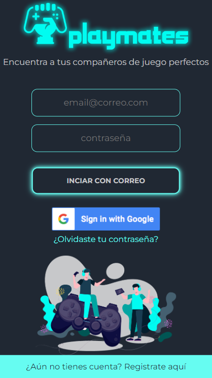
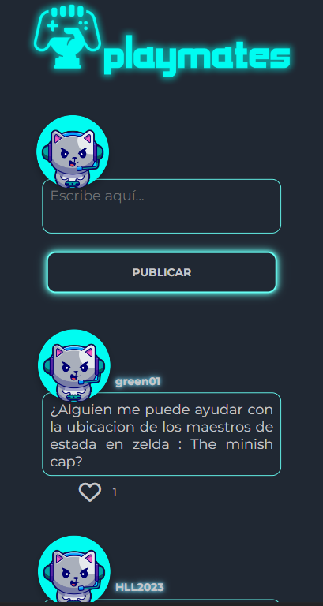

# Playmates
¡Te invitamos a probar nuestra aplicación Playmates! Puedes acceder a ella a través del siguiente enlace: 
[Playmates](https://playmates-79c82.web.app/)

## Índice

* [1. Descripción del producto](#1-descripción-del-producto)
* [2. Usuarios principales del producto](#2-usuarios-principales-del-producto)
* [3. Problema que resuelve el producto](#2-problema-que-resuelve-el-producto)

## 1. Descripción del producto

Playmates es una aplicación SAP diseñada para facilitar la búsqueda de otros jugadores con fines competitivos o para jugar juntos y pasar un buen rato en diferentes juegos. Esta aplicación está dirigida a jugadores de videojuegos que desean encontrar compañeros de juego de manera rápida y sencilla.

## 2. Usuarios principales del producto

Los principales usuarios de Playmates son los jugadores de videojuegos de todas las edades y niveles de habilidad que buscan interactuar con otros jugadores para mejorar su experiencia de juego. Estos usuarios pueden incluir:

Jugadores competitivos: Aquellos que desean formar equipos y competir en torneos o partidas clasificatorias. Estos jugadores buscan compañeros que compartan su nivel de habilidad y estén dispuestos a trabajar juntos para alcanzar objetivos comunes.

Jugadores casuales: Personas que juegan por diversión y quieren encontrar compañeros de juego relajados y amigables para compartir una experiencia de juego más social. Estos usuarios buscan compañeros con intereses similares y un enfoque más relajado hacia los juegos.

## 3. Problema que resuelve el producto

Playmates resuelve el problema común de los jugadores de videojuegos que desean encontrar compañeros de juego adecuados. Antes de la existencia de Playmates, los jugadores tenían que depender de métodos tradicionales como foros, redes sociales o la suerte de encontrar compañeros de juego al azar dentro del propio juego. Estas opciones pueden ser ineficientes y llevar mucho tiempo.
Con Playmates, los usuarios pueden buscar y conectarse con otros jugadores de manera más efectiva.
* Interacción social: Los usuarios pueden registrarse en Playmates utilizando su correo electrónico o cuenta de Gmail. Una vez que ingresan, pueden publicar en el muro en busca de jugadores y darles "like" a otras publicaciones. Esta interacción social permite que los jugadores encuentren fácilmente a otros jugadores interesados en los mismos juegos y establezcan conexiones con ellos.
